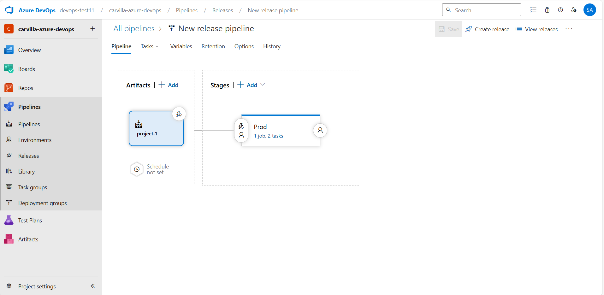
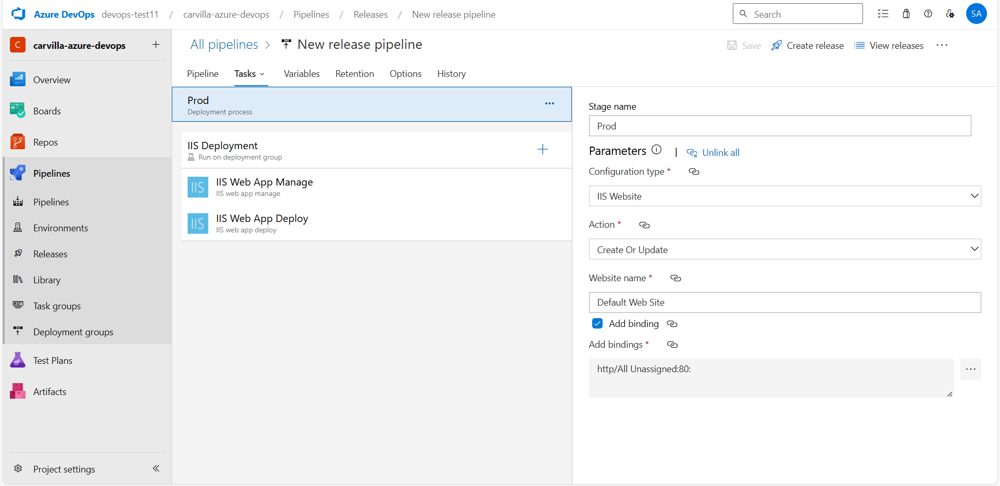

# CI/CD Pipelines
This project includes Azure Pipeline configurations for building Docker images. Below is a brief explanation of pipeline.

## Build Pipeline
The build pipeline is defined in the [`azure-pipelines-2.yml`](/azure-pipelines-2.yml) file. This pipeline triggers on every push to the master branch and is responsible for building and pushing Docker images to Docker Hub.

### Key Points
   - **Trigger**: The pipeline runs on changes to the master branch.
   - **Stages**: The Build stage handles building the Docker image.
   - **Jobs**: The Build job uses the latest Ubuntu VM image from a specified pool (mypool).
   - **Steps**: The Docker@2 task builds and pushes the Docker image to the Docker Hub repository seyma1km/test-azure with the tag latest.

## Deployment Pipeline

The deployment pipeline is set up using Azure Release Pipeline to deploy the Docker image to an IIS Website. Here’s a simple explanation of the process along with some screenshots for clarity.

1. **Creating the Release Pipeline:**
   First, I navigated to the Pipelines section in Azure DevOps, selected "Releases", and created a new pipeline.

2. **Adding an Artifact:**
   I linked the build pipeline as the source artifact. This step ensures that the release pipeline uses the Docker image built from the build pipeline.

3. **Creating and Configuring a Stage:**
   I added a new stage to the release pipeline and named it "Prod". For this stage, I chose the "IIS Website Deploy" template, which comes with two tasks: "IIS Web App Manage" and "IIS Web App Deploy".

4. **Deploying the Docker Image:**
   In the "Prod" stage, I configured the tasks to manage and deploy the IIS web application using the Docker image from Docker Hub (`seyma1km/test-azure:latest`).

### Screenshots

1. **Release Pipeline Overview:**
   

2. **Task Configuration:**
   

These steps ensure that whenever the release pipeline is triggered, the Docker image is automatically deployed to the IIS Website.
